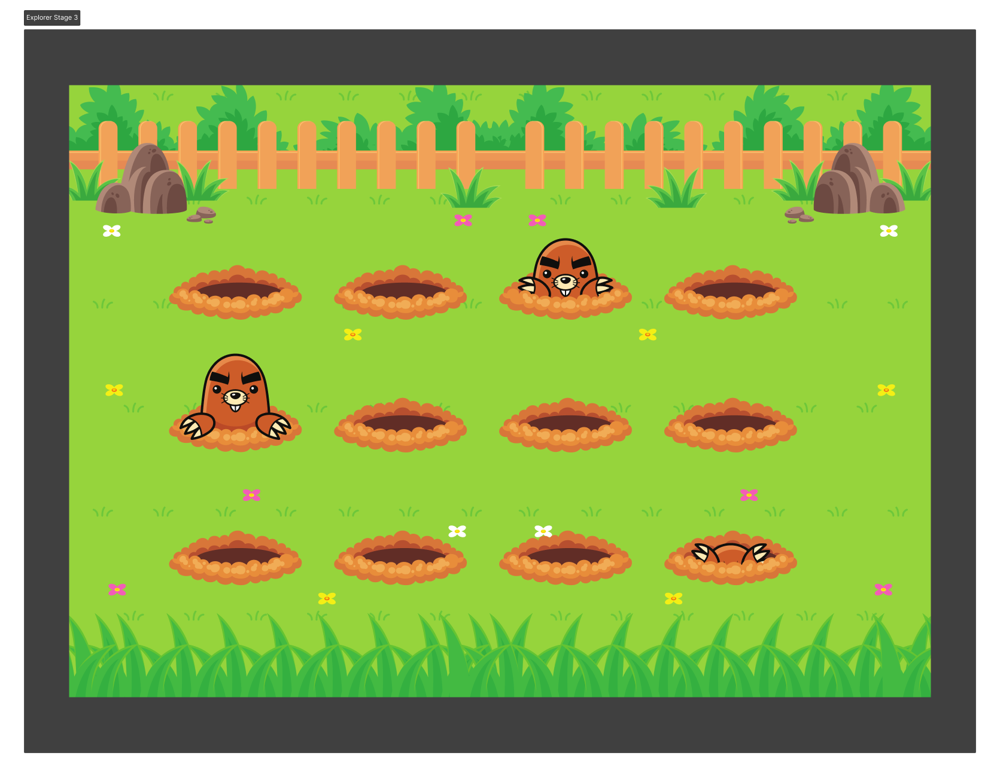

<h1> Whack a Mole </h1>

 

<h2> O Projeto </h2>

O projeto foi desenvolvido como desafio do curso Explorer da Rocketseat. 

O desafio desse projeto consiste na criação de uma animação simples de toupeiras, onde elas entram e saem de seus buracos.  

  

 

Quer conferir como ficou o Jardim das Toupeiras? 

[Visite o projeto online]()

 

<h2> O intuito do projeto </h2>

O intuito do projeto foi colocar em prática os conhecimentos acerca de:

### CSS

- animations / @keyframes
- grid-template-columns / grid-template-rows / grid-column / grid-auto-flow
- place-content / align-self / justify-items / justify-content
- centralizar div com position/grid/flex/margin
- transform

 

<h2> Tecnologias </h2>

Foi utilizado as seguintes tecnologias para desenvolver esse projeto:

- HTML
- CSS
- figma
- Git
- GitHub
